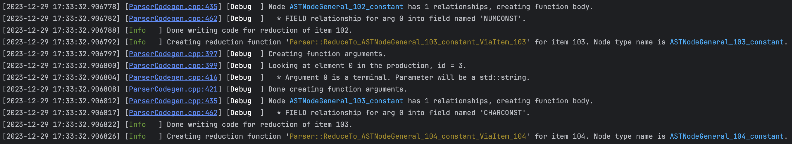

# Lightning logging

A small but powerful header-only logging library that depends only on standard C++17 features and the standard library.
Attempts to be a very fast streaming logging library without sacrificing too much performance. Current, it is just a bit
slower than spdlog, a very fast formatting logging library.

Very fast, easy to use, easy to customize, and makes pretty logs.



## Quick start

Lightning is a header only library that only depends on standard C++17 features. The entirety of the library is in a
single header, so after setup (see [BUILDING.md](BUILDING.md)), simply ```#include <Lightning/Lightning.h>``` and you
are ready to go.

The simplest possible way to create a logger that writes to std::cout:

```C++
// Create a simple logger with no attributes and default formatting.
Logger logger(std::make_shared<OstreamSink>());

LOG_SEV_TO(logger, Info) << "Hello world";
```

Global logging can be set up by accessing the global logger and core,

```C++
// Add sink to the global logger, set formatting.
auto sink = std::make_shared<OstreamSink>();
Global::GetCore()->AddSink(sink)
    .SetAllFormatters(formatting::MakeMsgFormatter("[{}] [{}] {}",
        formatting::SeverityAttributeFormatter{},
        formatting::DateTimeAttributeFormatter{},
        formatting::MSG /* Represents the message */ ));
```

Global logging is most easily used via the logging macros LOG() and LOG_SEV(severity),

```C++
// Log without severity.
LOG() << "Starting run...";

// Log with severity. The levels are Debug, Info, Warning, Error, and Fatal.
LOG_SEV(Info) << "Done with workflow. Processing next item with name " << item.GetName() << ".";
```

As usual, whatever is streamed using the logging macros (e.g., function calls) will only be evaluated if the logging
record opens, which occurs if the set of core-level filters allow the message (given its attributes), and at least one
sink accepts the message (again, given its attributes). Lightning has very fast message rejection time, in my
benchmarks, if the message is rejected by its severity at the core level, it can reject around 2 billion messages a
second, and if the message is accepted by the core, but rejected by the (single) sink, it can reject around 1 billion
messages a second (on my platform - see benchmarking at the bottom).

### Severity level filtering

The most common filtering for logging messages is filtering by severity. A typical project may have many "debug" or "
trace" level logging messages, but may want to only capture important messages, or may want to route only very important
messages to specific sinks. There are core level filters, that filter any message coming into a logging core, and
sink-level filters which (surprise, surprise) filter any messages coming into a sink.

To set the acceptance levels of a sink,

```C++
// Shared pointer to the sink is named 'fs'
fs->GetFilter().Accept({ Severity::Error });

// Sinks can also set whether they accept messages without a severity.
// This is false by default, and can be controlled by passing a flag in 
// the AcceptNoSeverity function.
fs->GetFilter().AcceptNoSeverity(true);
```

Setting the acceptance level of a core is exactly analogous, e.g.

```C++
// Accept only messages that are of severity levels Warning or Error.
logger.GetCore()->GetFilter().Accept({ Severity::Warning, Severity::Error });
```

### Formatting messages

Each sink uses an object of type ```BaseMessageFormatter``` which it uses to format logging records. The best way to
create a formatter is the ```MakeMsgFormatter``` function, which takes a format string and a number
of ```AttributeFormatter``` instances as arguments, and returns a unique pointer to a new formatter. The format string
will replace the N-th ```{}``` in the format string with the formatted attribute from the N-th attribute formatter.

For example,

```C++
// Set to display the date, logger name, severity, and print the message
fs->SetFormatter(MakeMsgFormatter("[{}] [{}] [{}] {}",
                                  formatting::DateTimeAttributeFormatter{},
                                  formatting::LoggerNameAttributeFormatter{},
                                  formatting::SeverityAttributeFormatter{},
                                  formatting::MSG));
LOG_SEV_TO(logger, Info) << "Hello world!";
// Possible output (time and logger name will vary): 
// [2023-07-24 15:07:01.152403] [main-logger] [Info   ] Hello world!
```

Another built in formatter is a formatter that defines different formatters for each severity level.
    
```C++
auto formatter = std::make_unique<formatting::FormatterBySeverity>();
{
    auto default_fmt = MakeMsgFormatter("[{}] [{}] {}",
                                        formatting::DateTimeAttributeFormatter{},
                                        formatting::SeverityAttributeFormatter{},
                                        formatting::MSG);
    // Formatter for "low levels" of severity displace file and line number.
    auto low_level_fmt = MakeMsgFormatter("[{}] [{}:{}] [{}] {}",
                                          formatting::DateTimeAttributeFormatter{},
                                          formatting::FileNameAttributeFormatter{true},
                                          formatting::FileLineAttributeFormatter{},
                                          formatting::SeverityAttributeFormatter{},
                                          formatting::MSG);
   
    formatter->
        // Set formatter for Trace and Debug severities.
        SetFormatterForSeverity(LoggingSeverity <= Severity::Debug, *low_level_fmt)
        // Set formatter for all other severities (including records without severities).
        .SetDefaultFormatter(std::move(default_fmt));
}
Global::GetCore()->SetAllFormatters(*formatter);
```


### Logger name

The logger name can be set via the ```Logger::SetName``` function, e.g.

```C++
logger.SetName("main-logger");
```

There is a built-in attribute formatter ```LoggerNameAttributeFormatter``` that can write the logger name as a string.

### Logging time stamp

The logging time is by default attached to every logging message, though this can be disabled by

```C++
logger.SetDoTimeStamp(false);
```

The built-in date-time formatter is ```DateTimeAttributeFormatter```, which formats the date in "%Y-%m-%d %h:%m:%s.%u"
format.

### Severity

The ```SeverityAttributeFormatter``` is the built-in attribute formatter for severity. If the sink settings allow for
it, the severity level will be rendered in color. The severity levels are serialized to strings of the same width,
e.g. "Info   ", "Warning", so that alignment is preserved. The color and serialized severity for level can be set in
the ```SeverityAttributeFormatter```, e.g.

```C++
formatting::SeverityAttributeFormatter{}
    .SeverityName(Severity::Info, "INFO")
    .SeverityFormatting(Severity::Info, 
                        formatting::AnsiForegroundColor::Red, 
                        formatting::AnsiBackgroundColor::Yellow);
```

would create a formatter that prints "INFO" in red letters on a yellow background (if the sink supports colors).

## User defined formatting

Streaming into record handlers (in particular, using the macros like ```LOG_SEV```) allows for formatting customization
points, if you defined an ADL-findable ```format_logstream(T&&, lightning::RefBundle&)``` function, this will be used to
format your object. If the type does not have a ```format_logstream``` function, similar to std::format, Lightning
relies on formatting "segments," all deriving from the ```BaseSegment``` class to create a string representation of the
logging message. If a ```format_logstream``` function cannot be found for a type ```T``` being streamed, it will be
checked if a specialization of the template class ```Segment``` for the type. If this cannot be found, a ```to_string```
will be searched for (via ADL). If this does not work and ```T``` has a ostreaming operator available, this will be used
to format the object into a string. If none of the aforementioned are available, streaming will fail at compile time.

The most powerful customization point of these are ```format_logstream``` functions. Since the function will be passes
the
(mutable) record handler itself, this allows you to execute operations on the object to log and add dispatch-time
formatting whenever an object of type ```T``` is streamed into a ```RefBundle```. Dispatch-time-formatting objects allow
for decisions about the formatting to be made based on sink-specific settings, at the time that the message is *
dispatched*
to an actual sink (and is reevaluated for every sink). For example, the built in ```AnsiColor8Bit``` formatting type
will use ansi escape sequences to color test *if* the sink that is dispatching the message supports color. Another
example is the ```NewLineIndent``` formatting object, which knows how much to indent a message based on the width of the
log "header"
so that the message aligns with the start of the message on the first line. The width of the log header depends on the
formatting for the specific sink, so it cannot be decided until dispatch time.

For example, writing a format logstream function for std::exception like this:

```C++
namespace std {

void format_logstream(const exception& ex, lightning::RefBundle& handler) {
  using namespace lightning::formatting;

  handler << NewLineIndent
          << AnsiColor8Bit(R"(""")", AnsiForegroundColor::Red)
          << AnsiColorSegment(AnsiForegroundColor::Yellow); // Exception in yellow.
  const char* begin = ex.what(), *end = ex.what();
  while (*end) {
    for (; *end && *end != '\n'; ++end); // Find next newline.
    handler << NewLineIndent << string_view(begin, end - begin);
    for (; *end && *end == '\n'; ++end); // Pass any number of newlines.
    begin = end;
  }
  handler << AnsiResetSegment
          << NewLineIndent // Reset colors to default.
          << AnsiColor8Bit(R"(""")", AnsiForegroundColor::Red);
}

} // namespace std
```

and throwing an exception like this

```C++
try {
    throw std::runtime_error("oh wow, this is a big problem\nand I don't know what to do");
}
catch (const std::exception& ex) {
    LOG_SEV(Fatal) << "Caught 'unexpected' exception: " << ex;
    return 0;
}
```

results in formatting that looks like this

Note that this uses both color formatting and NewLineIndent formatting.

## Benchmarking

I have tried to take a "profiling driven" approach to this version of Lightning logging, aimed to keep it competitive or
faster than other commonly used logging frameworks such as spdlog and boost logging. At the present, I have mostly
focused on single threaded logging performance. The code containing these experiments and generating this table can be
found in [applications/profile-table-generation.cpp](applications/profile-table-generation.cpp), and there is more
extensive profiling (that doesn't generate
markdown tables)
in [applications/profile-lightning.cpp](applications/profile-lightning.cpp).

Profiling done on a 2019 MacBook Pro, Apple M1 Pro, 10 core, 16GB memory.

******************************************************************************************

Single threaded: 250,000 messages

| Experiment Name                            | Elapsed time (secs) | Rate           |
|--------------------------------------------|:-------------------:|----------------|
| MsgFormatter                               |      0.044316       | 5,641,314/sec  |
| std::ofstream, with message, static header |      0.060310       | 4,145,235/sec  |
| EmptySink                                  |      0.025524       | 9,794,735/sec  |
| TrivialDispatchSink                        |      0.024978       | 10,008,774/sec |

******************************************************************************************

Single threaded, Types: 250,000 messages

| Experiment Name                  | Elapsed time (secs) | Rate          |
|----------------------------------|:-------------------:|---------------|
| C-string                         |      0.046936       | 5,326,378/sec |
| Long C-string                    |      0.063292       | 3,949,930/sec |
| Many C-strings                   |      0.093344       | 2,678,260/sec |
| String                           |      0.056923       | 4,391,913/sec |
| Integer                          |      0.045571       | 5,485,980/sec |
| Many integers                    |      0.099563       | 2,510,977/sec |
| Colored Integer                  |      0.058169       | 4,297,794/sec |
| Bool                             |      0.083083       | 3,009,025/sec |
| Float                            |      0.077367       | 3,231,332/sec |
| Thread ID                        |      0.088423       | 2,827,305/sec |
| Combo                            |      0.106442       | 2,348,690/sec |
| Use-defined exception formatting |      0.407737       | 613,140/sec   |

******************************************************************************************

Single threaded: 250,000 messages, non-acceptance

| Experiment Name    | Elapsed time (secs) | Rate              |
|--------------------|:-------------------:|-------------------|
| Non-accepting sink |      0.000243       | 1,030,927,835/sec |
| Non-accepting core |      0.000120       | 2,084,775,302/sec |

******************************************************************************************

Multi threaded (4 threads): 250,000 messages

| Experiment Name              | Elapsed time (secs) | Rate          |
|------------------------------|:-------------------:|---------------|
| One logger, multiple threads |      0.041597       | 6,010,036/sec |
| Multiple loggers, same sink  |      0.092153       | 2,712,891/sec |

# Building and installing

See the [BUILDING](BUILDING.md) document.

# Contributing

See the [CONTRIBUTING](CONTRIBUTING.md) document.

# Licensing

<!--
Please go to https://choosealicense.com/licenses/ and choose a license that
fits your needs. The recommended license for a project of this type is the
Boost Software License 1.0.
-->
